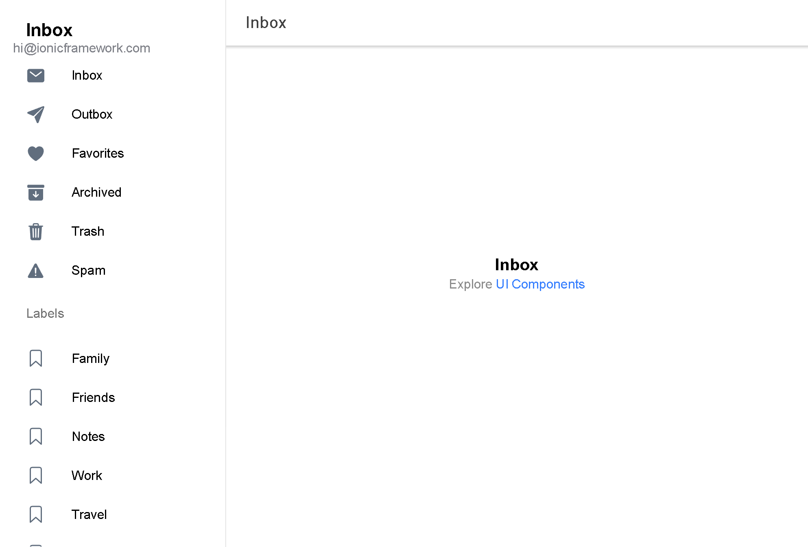

<h1 align="center">Svelte Ionic Supabase Sidemenu</h1> <br>

# Setup

## Required environment variables:

`VITE_SUPABASE_URL` (https://app.supabase.com/project/_/settings/api: see Project URL)

`VITE_SUPABASE_KEY` (https://app.supabase.com/project/_/settings/api: see Project API keys / Anon / Public)

### Local Development

Create a file called `.env` in the root of your project.

I.e.:
```
VITE_SUPABASE_URL=https://xxxxxxxxxxxxxxxxxxxx.supabase.co
VITE_SUPABASE_KEY=[project_anon_key_here]
```

## Services

### loadingBox

##### example
```js  
import { loadingBox } from "$services/loadingMessage";

const loader = await loadingBox('Logging in...');
const {user, session, error} = 
  await supabaseAuthService.signInWithEmail(email, password);
  if (error) { // handle error
      loader.dismiss();
  } else { // handle success
      loader.dismiss();
  }
```

### toast

##### usage
`toast(message: string, color: string = 'danger', duration: number = 3000)`

##### example

```js
import { toast } from "$services/toast";

toast("Password was updated", "success", 3000);
```

### SupabaseAuthService

#### Login

The login component will handle:
- sign up
- email login in
- magic links
- sign in with OAuth providers
- password reset redirects

##### example

Most often this would be used in the Menu component, but can be placed on any page where you want to allow the user to log in.

```js
import Login from '$components/Login/Login.svelte'

<Login
  providers={['google', 'facebook', 'twitter']}
  profileFunction={() => {
    // console.log('do something when user clicks on their email address')
  }} 
/>
```

#### Subscribe to user changes:

##### example

```js
import SupabaseAuthService from '$services/supabase.auth.service'
import type { User } from '@supabase/supabase-js';
import { onDestroy, onMount } from 'svelte';
let user = null;
let userSubscription: any;
onMount(() => {
  userSubscription = SupabaseAuthService.user.subscribe((newuser: User | null) => {
    user = newuser;
    console.log('got user:', user)
  })
})
onDestroy(() => {
  userSubscription.unsubscribe()
})	

```

### SupabaseDataService

Get and save data to your Supabase PostgreSQL database.  Data can be cached to localStorage so subsequent loads are faster (loaded from cached and then silently updated from database data after-the-fact).  This also allows the app to work offline to display any cached data automatically (without any necessary interaction from the user).

#### Usage


### Notes

#### Login
The login has been implemented as a modal, so it can be used on any page where a user needs to be logged in to use a certain feature (without forcing the user to navigat to a separate page.)

#### Back Button
Since the back button isn't functional in this library yet, here's a simple workaround:

```js
<ion-button on:click={()=>{history.back();}}>
  <ion-icon slot="start" icon={chevronBackOutline}></ion-icon>
</ion-button>
```

<h2>BASED ON</h2>
<h1 align="center">Ionic Svelte Demo - SIDEMENU</h1> <br>
<p align="center">
  <a href="https://ionicsvelte.firebaseapp.com">
    
  </a>
</p>
<br>
<p align="center">
  A showcase app for Ionic. Supercharged by Svelte and Vite.
</p>
<br>

# Ionic Svelte Blank starter
A starter app for all Ionic UI elements - based on Ionic's Sidemenu Starter

Install this starter:
```bash
git clone https://github.com/Tommertom/svelte-ionic-sidemenu-demo.git 
cd svelte-ionic-sidemenu-demo
npm i
npm run dev
```

N.B. Menucontroller does not see the menu by default - you need to register the menu item manually - extra function added to help you with that (`registerMenu(menu-id:string)`) - `<ion-menu {side} content-id="main" menu-id="mainmenu">`see Menu.svelte with working example


## Screenshots

<table>
  <tr>
    <th>Main - phone</th>
    <th>Menu - phone</th>
    <th>Desktop - sidepane menu</th>
  </tr>
  <tr>
    <td>
</td>
    <td></td>
     <td></td>
     
  </tr> 
</table>

## All starters
* Blank demo - https://github.com/Tommertom/svelte-ionic-blank-demo
* Tabs demo - https://github.com/Tommertom/svelte-ionic-tabs-demo
* Sidemenu demo - https://github.com/Tommertom/svelte-ionic-sidemenu-demo
* Mystarter demo - taking photo with Capacitor - https://github.com/Tommertom/svelte-ionic-mystarter-demo
* List demo - https://github.com/Tommertom/svelte-ionic-list-demo
* Conference demo - https://github.com/Tommertom/svelte-ionic-conference-demo

And the official demo app - https://github.com/Tommertom/svelte-ionic-app

  
## PWA Interface - easing the PWA work in your app
To help you managing state of the service worker and the various events, a simple svelte store is provided for (`lib/pwa.ts`). This store wraps the various events of the service worker in a readable store and a number of derived stores so you can easily listen to various events.

While most tutorials provide you the basics to do all these separately and in an "Hello world" fashion, having all in a store helps wiring things up to the UI across various places in the code. 

The following derived stores are implemented:
- `needRefresh`:`boolean` telling you if there is an update available
- `updateObject`:`undefined|UpdateObject`. When UpdateObject is provided, you can call its `updateSWObject()` method to update the app
- `offlineReady`:`boolean` telling you all offline assets have been loaded
- `registerError`:`any` - the error message when the registration of the service worker failed
- `registration`:`undefined|ServiceWorkerRegistration` - the service worker registration object - when succesfull
- `beforeInstallPrompt` - `undefined|BeforeInstallPromptEvent` - which you can use to fire the `.prompt()` method to invoke the install prompt. N.B. this needs to happen right after an userevent (like button press)!

All these props are also available via the `pwaStatusStream` readable store.

## Roxi Routify 3
This code uses Roxi's newest version of its router. See https://v3.ci.routify.dev/docs#guide to know more. By the time of this writing, this is actually still in beta. If you want to change router, please make sure you change the hooks in IonPage.svelte (part of `$ionic/svelte/components/IonPage.svelte`);

# Issues - work in progress and acknowledgments
Please refer to the README on the main repo - https://github.com/Tommertom/svelte-ionic-app